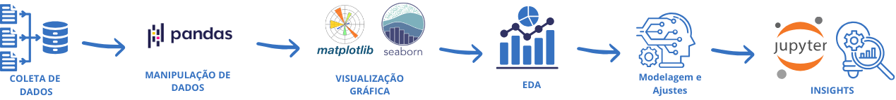
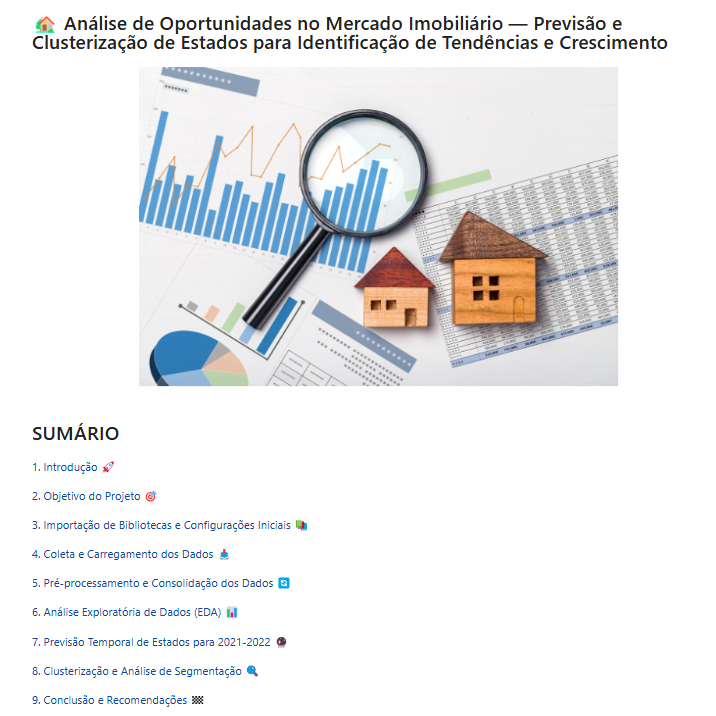
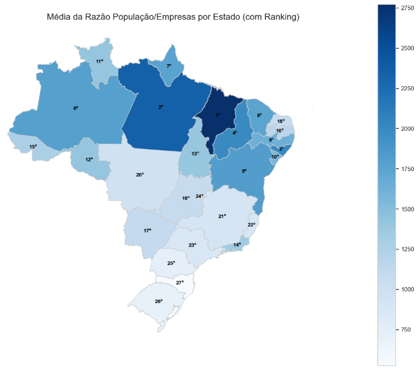
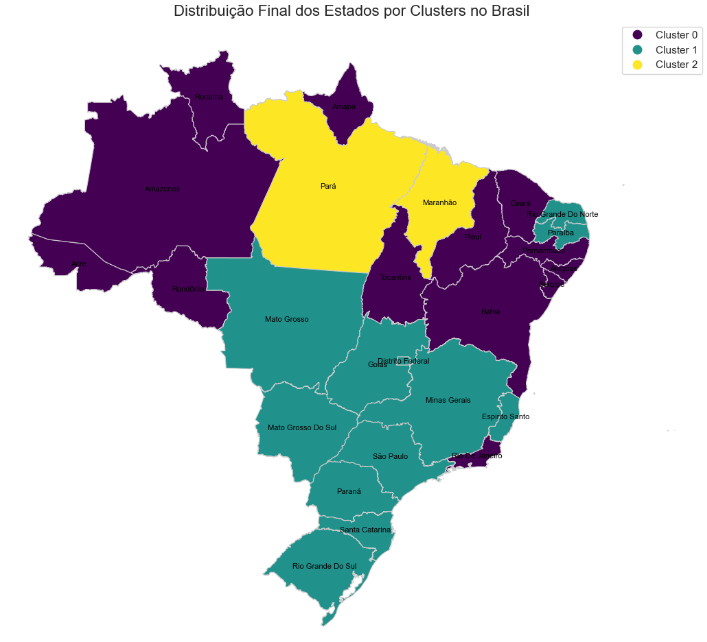

# 🏡 Análise de Oportunidades no Mercado Imobiliário  

  
  
  
  
  
  
  
  
  
  
  
  

---

## 📝 **Descrição do Projeto**  

Neste projeto, analisamos o comportamento de estados brasileiros no setor imobiliário com foco na faixa etária de consumidores predominante (38 a 58 anos). A análise consiste em prever a tendência de crescimento de consumidores e identificar oportunidades futuras por estado.

O projeto foi estruturado em etapas que vão desde a coleta e manipulação de dados até a aplicação de modelos preditivos e a segmentação dos estados por meio de clusterização.

**Objetivos principais:**
- Estimar o comportamento do mercado imobiliário entre 2021 e 2022 com base nos dados históricos de 2007 a 2020.
- Agrupar estados com comportamento similar para identificar quais estão mais saturados e quais oferecem maiores oportunidades de crescimento.

---

## 🗂️ **Estrutura do Repositório**  

- **01_Base_de_Dados**: Contém os arquivos de dados utilizados para análise.  
- **02_Analise**: Contém o arquivo Jupyter Notebook com a análise e modelagem.  
- **03_Recursos**: Contém recursos visuais utilizados no projeto (imagens e diagramas).  

---

## 💾 **Demonstração e Uso**  

Você pode explorar a análise de duas formas:  

1. **Visualização Direta no GitHub:**  
   - Acesse a pasta **02_Analise** e abra o notebook **real-estate-opportunities-analysis.ipynb** diretamente no GitHub.  
   - [Clique aqui para acessar a análise](https://github.com/tnleite/real-estate-opportunities-analysis/blob/main/02-Analise/real-estate-opportunities-analysis.ipynb).  

2. **Execução Local:**  
   - Clone o repositório e instale as dependências usando o arquivo `requirements.txt`:  
     
   - Abra o notebook no Jupyter ou em uma plataforma de sua preferência e execute as células sequencialmente para explorar as análises.

---

## 🔍 **Estrutura do Projeto**  

### **Parte 1: Coleta e Preparação de Dados**  
- Extração de dados do IBGE e API SIDRA sem bibliotecas externas.  
- Uso de interpolação para ajuste das faixas etárias aos intervalos requeridos.  

### **Parte 2: Análise Exploratória de Dados (EDA)**  
- Visualização da evolução dos consumidores ao longo do tempo por estado.  
- Análise de correlações para identificar fatores relevantes.  

### **Parte 3: Modelagem Preditiva**  
- Aplicação de modelos **XGBoost**, **CatBoost** e **LightGBM** para previsão dos anos de **2021** e **2022**.  
- Avaliação dos modelos com base em métricas de erro, como **RMSE**, **MAE** e **R²**.

### **Parte 4: Clusterização**  
- Uso de K-Means, Agglomerative Clustering e DBSCAN para agrupar estados.  
- Escolha do modelo final com base nas métricas de Silhouette e Davies-Bouldin.  
- Interpretação dos clusters para identificação de estados saturados e com oportunidades.  

---

## 🏗️ **Arquitetura e Fluxo de Análise**  

O fluxo segue a estrutura a seguir:  

1. **Coleta de Dados:** Importação e preparação de dados históricos.  
2. **Manipulação e Limpeza:** Tratamento de inconsistências e valores ausentes com **Pandas**.  
3. **Visualização:** Gráficos exploratórios com **Matplotlib** e **Seaborn**.  
4. **EDA:** Entendimento inicial dos padrões regionais e temporais.  
5. **Modelagem Preditiva:** Previsão dos próximos períodos usando séries temporais e regressão.  
6. **Clusterização:** Agrupamento dos estados com perfis semelhantes de evolução no mercado.  
7. **Insights:** Identificação de oportunidades futuras e recomendações estratégicas.  

---

## 📈 **Impacto e Resultados**

- **Identificação de Oportunidades de Mercado:** Descobrimos os estados com maior potencial de crescimento para direcionamento de ações comerciais, campanhas de marketing e investimentos no setor imobiliário.  
- **Clusters Estratégicos:** Agrupamos os estados brasileiros em perfis claros e acionáveis, identificando aqueles com alta demanda emergente, crescimento estável e saturação de mercado.  
- **Projeções de Crescimento Consistentes:** Por meio da modelagem preditiva, fornecemos estimativas confiáveis de crescimento de consumidores para os anos de 2021 e 2022, permitindo planejamento de longo prazo.  
- **Decisões Baseadas em Dados:**  
  - **Estados Emergentes:** Prioridade para campanhas de marketing e desenvolvimento de novos projetos.  
  - **Estados em Crescimento Estável:** Monitoramento contínuo e investimentos moderados.  
  - **Estados Saturados:** Ajuste de estratégias para evitar superoferta e otimização de portfólio de imóveis.  

Este projeto oferece uma base analítica para apoiar o setor imobiliário em suas decisões estratégicas, minimizando riscos e maximizando retornos em regiões de alto potencial.

---

## 🛠️ **Tecnologias Utilizadas**  

- [Python](https://www.python.org/)  
- [Jupyter Notebook](https://jupyter.org/)  
- [Pandas](https://pandas.pydata.org/)  
- [NumPy](https://numpy.org/)  
- [Matplotlib](https://matplotlib.org/)  
- [Seaborn](https://seaborn.pydata.org/)  
- [Scikit-Learn](https://scikit-learn.org/)  
- [LightGBM](https://lightgbm.readthedocs.io/)  
- [CatBoost](https://catboost.ai/)  

---

## 🖼️ **Screenshots**  

Aqui estão algumas capturas de tela das análises:  

  

  

  

---

## 📞 **Contato**  

- 📫 [thiago.leit@hotmail.com](mailto:thiago.leit@hotmail.com)  
- 💼 [LinkedIn](https://www.linkedin.com/in/tnleite/)  
- ✍🏻 [Medium](https://medium.com/@thiago.leit)  
- 🌐 [Portfólio](https://thiagoleitedata.com.br)  

